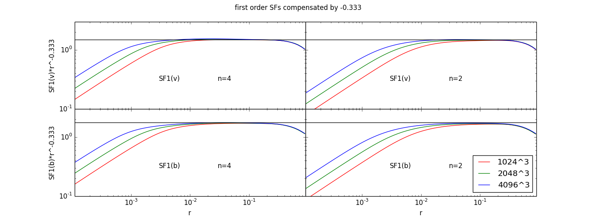

# Public release of high-resolution datacubes of MHD turbulence

Go to https://app.globus.org/file-manager?origin_id=cd71b5d6-8850-426a-b057-0b269b10fb82&origin_path=%2F
to download MHD turbulence datacubes up to 4096^3 for balanced turbulence and up to 3072^3 for imbalanced turbulence.

This repository contains precomputed statistics, pictures and Python scripts for the RMHD runs -- two series of simulations 1024^3, 2048^3 and 4096^3, with dissipation term of second (n) and 4th (h) order.

Directories with "n" indicate simulations with ordinary 2nf order viscosity and "h" indicates 4th order hyperviscosity. "Scripts" are for code to plot various spectra and structure functions from precomputed statistics and "pics" are examples for these plots.

For the description of code, setup and published pictures, please refer to [ApJ **801** L9](https://ui.adsabs.harvard.edu/abs/2015ApJ...801L...9B/abstract) and [ApJ **784** L20](https://ui.adsabs.harvard.edu/abs/2014ApJ...784L..20B/abstract)

**spec\_play.py** -- plots three commonly used types of spectra -- 3D integrated over solid angle (used primarily in numerics), 1D (used e.g. in solar wind measurements), 1D parallel (used in air and water turbulence measurements). They are related by well known expressions (see inside the script or [Monin & Yaglom vol. 2](https://ui.adsabs.harvard.edu/abs/1976JAM....43..521M/abstract). Note, that these spectra have different shapes and different subjectively perceived scalings, e.g. at the beginning of the spectra the scaling is k^-1.40 for 3D and k^-1.44 for 1D correspondingly.

**spec\_interv.py** -- Plots maximum continuous interval of the spectra with a particular power law (-5/3 and -3/2 in this case). Note that this does not scale as a cube size as expected from theory, although theory does not guarantee flat regions of spectra. Also, the flat intervals are tiny -- a factor of 5 (compare this with cube size of 4096). Most importantly, this does not produce consistent result if we use three different types of spectra (see also flat\_region\_3d.png, flat\_region\_1d\_parallel.png from the archive):

**kmax\_interv.py** -- This script finds the maximum log-interval dissipation wavenumber (the maximum in E(k)k^3) and plots it, as well as the value of E(k) -- this basically tells us how dissipation scale (Kolmogorov scale) and Kolmogorov velocity scales with Reynolds number. Note that 5/3 theory works well for this basic measurement, while 3/2 does not:

**spec\_paper.py** -- Reproduces all six plots (scaling study) from [ApJ **784** L20](https://ui.adsabs.harvard.edu/abs/2014ApJ...784L..20B/abstract). Note that scaling study, by design, is completely consistent between all three types of spectra, or in fact any measurement which could be derived from spectral measurement. For example second order structure function (SF) can be calculated from spectrum (see, e.g. [Monin & Yaglom vol. 2](https://ui.adsabs.harvard.edu/abs/1976JAM....43..521M/abstract).

**sf\_conv.py** -- this is convergence study for the second order SF.

Note that the result is the same as in ApJ 784 L20 -- there's a convergence for 5/3, but no convergence for 3/2. This does not depend on the subjective perception of flatness (e.g. here SF looks flat compensated by r^-2/3, while the 3d spectrum from ApJ paper does not look particularly flat compensated by k^5/3. This doesn't matter: scaling study captures overall scaling between simulations with different Re, so it's a rigorous method, while subjective perception of flatness can not produce consistent result even with statistically equivalent measurements, i.e. spectra of different types or spectra and SFs.

**sf\_play.py** -- This plots SFs compensated by r^-0.58 (this correspond to spectral scaling of k^-1.58) -- such a spectrum is not motivated by any physics, it is the one that makes SFs looks most flat. Given enough number of measurements and/or measures, one can always find a measure which is looks like flat power law -- it is important not to follow this selection bias and instead follow available rigorous scaling tests, such as scaling study, which has been successfully done in physics of turbulence and analysis of fluid measurements and numerical data for decades (see, e.g. [Sreenivasan 1995](http://adsabs.harvard.edu/abs/1995PhFl....7.2778S), [Gotoh et al 2002](http://adsabs.harvard.edu/abs/2002PhFl...14.1065G), etc).

Turns out, **first order structure functions** for both velocity and magnetic field follow distance^1/3, expected for Kolmogorov spectrum and are inconsistent with distance^1/4 from -3/2 model:

Anisotropy scaling between r\_par and r\_perp from structure functions:

Anisotropy scaling between k\_par and k\_perp from spectra:

